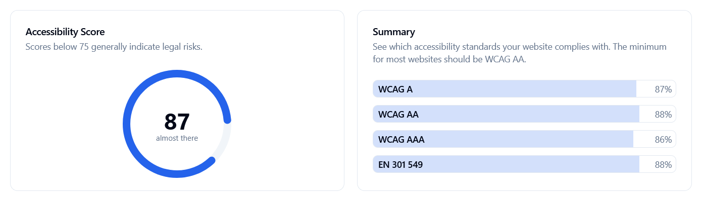

# Accessible, Semantic HTML Markup Optimized for Speed, SEO, and Compliance

A clean and fully semantic HTML5 layout optimized for accessibility (a11y), fast load times, and SEO. Verified with W3C Validator and built with best practices in structure, performance, and usability.

## Scores

## Pages

- [Home Page](https://mr-mashanlo.github.io/grants/dist/index.html)
- [Grants Page](https://mr-mashanlo.github.io/grants/dist/grants.html)
- [Programs Page](https://mr-mashanlo.github.io/grants/dist/programs.html)
- [Blog Page](https://mr-mashanlo.github.io/grants/dist/blog.html)
- [FAQ Page](https://mr-mashanlo.github.io/grants/dist/faq.html)
- [Sign in Page](https://mr-mashanlo.github.io/grants/dist/signin.html)